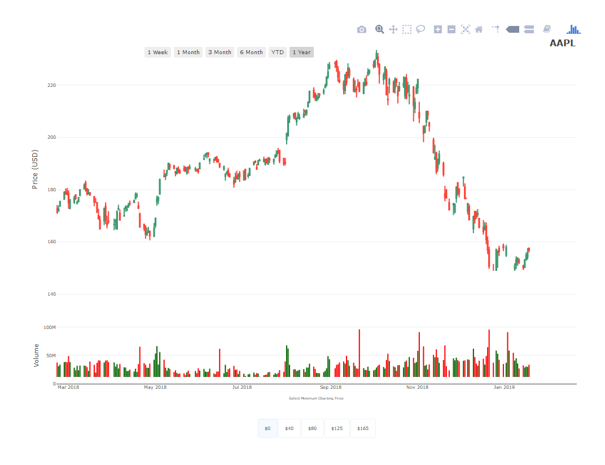

``` r
source("functions.R") ### to be replaced with library(robinhoodQF)
```

### Login

With Robinhood's recent modicification to their public API, accessing data now requires authorization headers and tokens that need to be generated using existing account credentials. The access\_robinhood uses account credentials to create the required authorization headers and tokens; however, account credentials are removed from the system memory immediately after all required authorization is created.

``` r
access_robinhood(username="username", password="password")
```

The access\_robinhood function will create a list called robinhoodUser, containing two R6 classes that underly most global methods in the robinhoodQF package. The robindhoodQF package is designed so that you will never need to directly interact with this list or its contents.

### Historical Data

The robinhoodQF package allows you to download the last year of daily data, as well as the last week of 5 minute tick data, from the Robinhood API for a list of shorthand ticker symbols:

``` r
mySymbols <- c("AAPL","AMZN")
dailyData <- robinhood_daily_historicals(symbols=mySymbols)
intradayData <- robinhood_intraday_historicals(symbols=mySymbols)
lapply(dailyData, head)
```

    ## $AAPL
    ##              open    high    low  close   volume
    ## 2018-02-21 172.83 174.120 171.01 171.07 37471623
    ## 2018-02-22 171.80 173.950 171.71 172.50 30991940
    ## 2018-02-23 173.67 175.650 173.54 175.50 33812360
    ## 2018-02-26 176.35 179.390 176.21 178.97 38162174
    ## 2018-02-27 179.10 180.480 178.16 178.39 38928125
    ## 2018-02-28 179.26 180.615 178.05 178.12 37782138
    ## 
    ## $AMZN
    ##               open    high     low   close  volume
    ## 2018-02-21 1485.00 1503.49 1478.92 1482.92 6304351
    ## 2018-02-22 1495.36 1502.54 1475.76 1485.34 4858063
    ## 2018-02-23 1495.34 1500.00 1486.50 1500.00 4418103
    ## 2018-02-26 1509.20 1522.84 1507.00 1521.95 4954988
    ## 2018-02-27 1524.50 1526.78 1507.21 1511.98 4808776
    ## 2018-02-28 1519.51 1528.70 1512.00 1512.45 4515023

``` r
lapply(intradayData, head)
```

    ## $AAPL
    ##                       open   high     low    close  volume
    ## 2019-02-15 14:30:00 171.22 171.70 171.000 171.1316 2412697
    ## 2019-02-15 14:35:00 171.13 171.23 170.490 171.0600  273892
    ## 2019-02-15 14:40:00 171.08 171.08 170.340 170.3650  230501
    ## 2019-02-15 14:45:00 170.40 170.85 170.130 170.2200  279939
    ## 2019-02-15 14:50:00 170.19 170.20 169.760 169.9200  363468
    ## 2019-02-15 14:55:00 169.92 170.56 169.905 170.4600  223322
    ## 
    ## $AMZN
    ##                         open     high      low    close volume
    ## 2019-02-15 14:30:00 1627.090 1628.910 1621.510 1622.342 233071
    ## 2019-02-15 14:35:00 1621.620 1622.550 1615.000 1620.220  46206
    ## 2019-02-15 14:40:00 1620.198 1620.198 1613.995 1614.540  41530
    ## 2019-02-15 14:45:00 1615.328 1620.490 1614.210 1615.535  32880
    ## 2019-02-15 14:50:00 1615.588 1615.588 1612.000 1612.680  31449
    ## 2019-02-15 14:55:00 1612.495 1615.590 1611.690 1612.260  27608

### Charting

The robinhoodQF package allows you to build interactive plotly charts for visualizing price series and plotting technical indicators.

``` r
myChart <- create_chart(tickerSymbol="AAPL", ohlcvData=dailyData$AAPL)
myChart$create_plot("candlestick")

## plot just closing prices
p1<-myChart$pricePlot
tmpFile1 <- tempfile(fileext = ".png")
export(p1, file = tmpFile1)
```


``` r
## plot closing prices with volume
p2<-myChart$volumeCombinedPlot
tmpFile2 <- tempfile(fileext = ".png")
export(p2, file = tmpFile2)
```



### Account Information

``` r
get_watchlist_tickers()
```

    ##  [1] "TQQQ" "LOGC" "MGTX" "AVRO" "ORTX" "SPXS" "VIXY" "VXX"  "TSRO" "QQQ" 
    ## [11] "ALL"  "MXIM" "SPY"  "CELG" "MRO"  "AAL"  "DLTR" "JPM"  "BK"   "GOOG"
    ## [21] "MA"   "PGR"  "ATHX" "CHK"  "TWOU" "C"    "BA"   "CRM"  "FLO"  "WMT" 
    ## [31] "ARKR" "IZRL" "ARKQ" "ARKG" "ARKW" "ARKK" "APPN" "SGH"  "WDC"  "OLED"
    ## [41] "OKTA" "DBX"  "KEM"  "NVDA" "MOMO" "ICHR" "ABT"  "NFLX" "HIMX" "LRCX"
    ## [51] "BZUN" "FB"   "YY"   "ABBV" "AAOI" "VZ"   "SMI"  "SODA" "BAC"  "TSM" 
    ## [61] "SNAP" "SQ"   "TXN"  "AMD"  "ACLS" "INTC" "ASX"  "MCHP" "MU"   "ON"  
    ## [71] "AMAT" "CSCO" "AKAM" "MLNX" "QCOM" "AGNC" "AAPL" "F"    "OCSL" "KO"

``` r
get_equity_holdings()
```

    ## $table
    ##                                        name quantity average_price
    ## CZZ                           Cosan Limited       30       10.6600
    ## IEMG iShares Core MSCI Emerging Markets ETF       20       49.9320
    ## SQQQ           ProShares UltraPro Short QQQ       18       11.8943
    ## XLF       Financial Select Sector SPDR Fund       35       28.0900
    ## AMZN          Amazon.com, Inc. Common Stock        1     1636.5000
    ## MSFT     Microsoft Corporation Common Stock       10      104.2407
    ## BABA          Alibaba Group Holding Limited        3      166.6572
    ## V                                 VISA Inc.        7      135.2506
    ## NTNX     Nutanix, Inc. Class A Common Stock       10       50.1627
    ## 
    ## $tickers
    ##  [1] "XBI"  "CZZ"  "IEMG" "SQQQ" "XLF"  "AMZN" "MSFT" "BABA" "V"    "NTNX"

``` r
robinhoodUser$account$positionsTable
```

<script data-pagedtable-source type="application/json">
{"columns":[{"label":[""],"name":["_rn_"],"type":[""],"align":["left"]},{"label":["name"],"name":[1],"type":["chr"],"align":["left"]},{"label":["quantity"],"name":[2],"type":["dbl"],"align":["right"]},{"label":["average_price"],"name":[3],"type":["dbl"],"align":["right"]}],"data":[{"1":"SPDR S&P Biotech ETF","2":"6","3":"79.9600","_rn_":"XBI"},{"1":"Cosan Limited","2":"30","3":"10.6600","_rn_":"CZZ"},{"1":"iShares Core MSCI Emerging Markets ETF","2":"20","3":"49.9320","_rn_":"IEMG"},{"1":"ProShares UltraPro QQQ","2":"0","3":"0.0000","_rn_":"TQQQ"},{"1":"LogicBio Therapeutics, Inc. Common Stock","2":"0","3":"0.0000","_rn_":"LOGC"},{"1":"MeiraGTx Holdings plc Ordinary Shares","2":"0","3":"0.0000","_rn_":"MGTX"},{"1":"AVROBIO, Inc. Common Stock","2":"0","3":"0.0000","_rn_":"AVRO"},{"1":"Orchard Therapeutics plc American Depositary Shares","2":"0","3":"0.0000","_rn_":"ORTX"},{"1":"Direxion Daily S&P 500 Bear 3x Shares","2":"0","3":"0.0000","_rn_":"SPXS"},{"1":"ProShares UltraPro Short QQQ","2":"18","3":"11.8943","_rn_":"SQQQ"},{"1":"ProShares VIX Short-Term Futures ETF","2":"0","3":"0.0000","_rn_":"VIXY"},{"1":"iPath S&P 500 VIX Short-Term Futures ETN due 1/30/2019","2":"0","3":"0.0000","_rn_":"VXX"},{"1":"TESARO, Inc. Common Stock","2":"0","3":"0.0000","_rn_":"TSRO"},{"1":"Financial Select Sector SPDR Fund","2":"35","3":"28.0900","_rn_":"XLF"},{"1":"Invesco QQQ Trust, Series 1","2":"0","3":"0.0000","_rn_":"QQQ"},{"1":"The Allstate Corporation","2":"0","3":"0.0000","_rn_":"ALL"},{"1":"Maxim Integrated Products, Inc. Common Stock","2":"0","3":"0.0000","_rn_":"MXIM"},{"1":"SPDR S&P 500 ETF Trust","2":"0","3":"0.0000","_rn_":"SPY"},{"1":"Celgene Corporation Common Stock","2":"0","3":"0.0000","_rn_":"CELG"},{"1":"Marathon Oil Corporation","2":"0","3":"0.0000","_rn_":"MRO"},{"1":"American Airlines Group Inc. Common Stock","2":"0","3":"0.0000","_rn_":"AAL"},{"1":"Dollar Tree Inc. Common Stock","2":"0","3":"0.0000","_rn_":"DLTR"},{"1":"JPMorgan Chase & Co.","2":"0","3":"0.0000","_rn_":"JPM"},{"1":"Bank of New York Mellon Corporation","2":"0","3":"0.0000","_rn_":"BK"},{"1":"Alphabet Inc. Class C Capital Stock","2":"0","3":"0.0000","_rn_":"GOOG"},{"1":"Mastercard Incorporated","2":"0","3":"0.0000","_rn_":"MA"},{"1":"Progressive Corporation","2":"0","3":"0.0000","_rn_":"PGR"},{"1":"Athersys, Inc. Common Stock","2":"0","3":"0.0000","_rn_":"ATHX"},{"1":"Amazon.com, Inc. Common Stock","2":"1","3":"1636.5000","_rn_":"AMZN"},{"1":"Chesapeake Energy Corp.","2":"0","3":"0.0000","_rn_":"CHK"},{"1":"2U, Inc. Common Stock","2":"0","3":"0.0000","_rn_":"TWOU"},{"1":"Citigroup Inc.","2":"0","3":"0.0000","_rn_":"C"},{"1":"Boeing Company","2":"0","3":"0.0000","_rn_":"BA"},{"1":"salesforce.com, inc.","2":"0","3":"0.0000","_rn_":"CRM"},{"1":"Flowers Foods, Inc.","2":"0","3":"0.0000","_rn_":"FLO"},{"1":"Walmart Inc.","2":"0","3":"0.0000","_rn_":"WMT"},{"1":"Microsoft Corporation Common Stock","2":"10","3":"104.2407","_rn_":"MSFT"},{"1":"Ark Restaurants Corp. Common Stock","2":"0","3":"0.0000","_rn_":"ARKR"},{"1":"ARK Israel Innovative Technology ETF","2":"0","3":"0.0000","_rn_":"IZRL"},{"1":"ARK Industrial Innovation ETF","2":"0","3":"0.0000","_rn_":"ARKQ"},{"1":"ARK Genomic Revolution Multi-Sector ETF","2":"0","3":"0.0000","_rn_":"ARKG"},{"1":"ARK Web x.0 ETF","2":"0","3":"0.0000","_rn_":"ARKW"},{"1":"ARK Innovation ETF","2":"0","3":"0.0000","_rn_":"ARKK"},{"1":"Appian Corporation Class A Common Stock","2":"0","3":"0.0000","_rn_":"APPN"},{"1":"SMART Global Holdings, Inc. Ordinary Shares","2":"0","3":"0.0000","_rn_":"SGH"},{"1":"Western Digital Corporation Common Stock","2":"0","3":"0.0000","_rn_":"WDC"},{"1":"Universal Display Corporation Common Stock","2":"0","3":"0.0000","_rn_":"OLED"},{"1":"Okta, Inc. Class A Common Stock","2":"0","3":"0.0000","_rn_":"OKTA"},{"1":"Dropbox, Inc. Class A Common Stock","2":"0","3":"31.5000","_rn_":"DBX"},{"1":"KEMET Corporation","2":"0","3":"0.0000","_rn_":"KEM"},{"1":"NVIDIA Corporation Common Stock","2":"0","3":"0.0000","_rn_":"NVDA"},{"1":"Momo Inc. American Depositary Shares","2":"0","3":"0.0000","_rn_":"MOMO"},{"1":"Ichor Holdings Ordinary Shares","2":"0","3":"0.0000","_rn_":"ICHR"},{"1":"Abbott Laboratories","2":"0","3":"58.6900","_rn_":"ABT"},{"1":"Netflix, Inc. Common Stock","2":"0","3":"0.0000","_rn_":"NFLX"},{"1":"Himax Technologies, Inc. American Depositary Shares","2":"0","3":"7.1700","_rn_":"HIMX"},{"1":"Lam Research Corporation Common Stock","2":"0","3":"0.0000","_rn_":"LRCX"},{"1":"Baozun Inc. American Depositary Shares","2":"0","3":"0.0000","_rn_":"BZUN"},{"1":"Facebook, Inc. Class A Common Stock","2":"0","3":"0.0000","_rn_":"FB"},{"1":"YY Inc. American Depositary Shares","2":"0","3":"96.1200","_rn_":"YY"},{"1":"ABBVIE INC.","2":"0","3":"99.3200","_rn_":"ABBV"},{"1":"Applied Optoelectronics, Inc. Common Stock","2":"0","3":"31.8500","_rn_":"AAOI"},{"1":"Verizon Communications","2":"0","3":"49.5500","_rn_":"VZ"},{"1":"Alibaba Group Holding Limited","2":"3","3":"166.6572","_rn_":"BABA"},{"1":"Semiconductor Manufacturing International Corporation","2":"0","3":"0.0000","_rn_":"SMI"},{"1":"SodaStream International Ltd. Ordinary Shares","2":"0","3":"97.4200","_rn_":"SODA"},{"1":"VISA Inc.","2":"7","3":"135.2506","_rn_":"V"},{"1":"Bank of America Corporation","2":"0","3":"0.0000","_rn_":"BAC"},{"1":"Taiwan Semiconductor Manufacturing Company Ltd.","2":"0","3":"0.0000","_rn_":"TSM"},{"1":"Snap Inc.","2":"0","3":"0.0000","_rn_":"SNAP"},{"1":"Square, Inc.","2":"0","3":"0.0000","_rn_":"SQ"},{"1":"Nutanix, Inc. Class A Common Stock","2":"10","3":"50.1627","_rn_":"NTNX"},{"1":"Texas Instruments Incorporated Common Stock","2":"0","3":"104.9200","_rn_":"TXN"},{"1":"Advanced Micro Devices, Inc. Common Stock","2":"0","3":"0.0000","_rn_":"AMD"},{"1":"Axcelis Technologies, Inc. Common Stock","2":"0","3":"24.7500","_rn_":"ACLS"},{"1":"Intel Corporation Common Stock","2":"0","3":"0.0000","_rn_":"INTC"},{"1":"Advanced Semiconductor","2":"0","3":"0.0000","_rn_":"ASX"},{"1":"Microchip Technology Incorporated Common Stock","2":"0","3":"93.6500","_rn_":"MCHP"},{"1":"Micron Technology, Inc. Common Stock","2":"0","3":"0.0000","_rn_":"MU"},{"1":"ON Semiconductor Corporation Common Stock","2":"0","3":"25.8100","_rn_":"ON"},{"1":"Applied Materials, Inc. Common Stock","2":"0","3":"0.0000","_rn_":"AMAT"},{"1":"Cisco Systems, Inc. Common Stock","2":"0","3":"0.0000","_rn_":"CSCO"},{"1":"Akamai Technologies, Inc. Common Stock","2":"0","3":"0.0000","_rn_":"AKAM"},{"1":"Mellanox Technologies, Ltd. Ordinary Shares","2":"0","3":"84.8000","_rn_":"MLNX"},{"1":"QUALCOMM Incorporated Common Stock","2":"0","3":"0.0000","_rn_":"QCOM"},{"1":"AGNC Investment Corp. Common Stock","2":"0","3":"18.8400","_rn_":"AGNC"},{"1":"Apple Inc. Common Stock","2":"0","3":"0.0000","_rn_":"AAPL"},{"1":"Ford Motor Company","2":"0","3":"0.0000","_rn_":"F"},{"1":"Oaktree Specialty Lending Corporation Common Stock","2":"0","3":"4.3500","_rn_":"OCSL"},{"1":"Coca-Cola Company","2":"0","3":"44.4700","_rn_":"KO"}],"options":{"columns":{"min":{},"max":[10]},"rows":{"min":[10],"max":[10]},"pages":{}}}
  </script>

``` r
robinhoodUser$account$optionsPositionsTable
```

<script data-pagedtable-source type="application/json">
{"columns":[{"label":["ticker"],"name":[1],"type":["fctr"],"align":["left"]},{"label":["quantity"],"name":[2],"type":["fctr"],"align":["left"]},{"label":["type"],"name":[3],"type":["fctr"],"align":["left"]},{"label":["price"],"name":[4],"type":["dbl"],"align":["right"]}],"data":[{"1":"SQQQ","2":"1.0000","3":"long","4":"106"},{"1":"SQQQ","2":"1.0000","3":"long","4":"159"}],"options":{"columns":{"min":{},"max":[10]},"rows":{"min":[10],"max":[10]},"pages":{}}}
  </script>

``` r
robinhoodUser$account$portfolioEquity
```

    ## NULL
