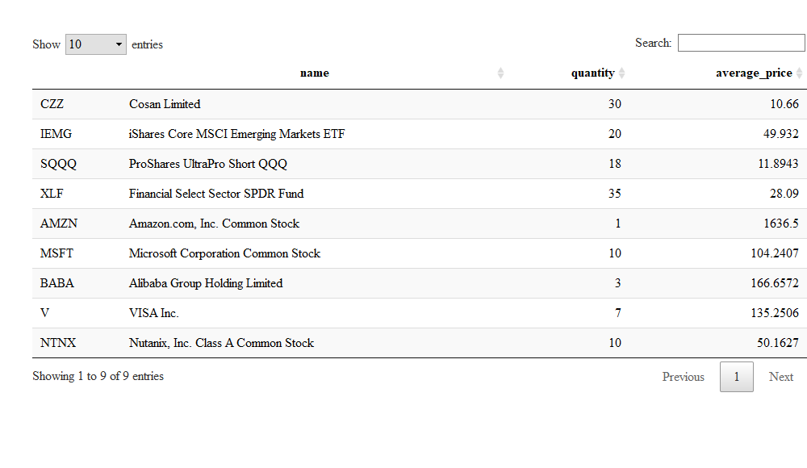

### robinhoodQF

``` r
source("functions.R") ### to be replaced with library(robinhoodQF)
```

### Login

With Robinhood's recent modicification to their public API, accessing data now requires authorization headers and tokens that need to be generated using existing account credentials. The access\_robinhood uses account credentials to create the required authorization headers and tokens; however, account credentials are removed from the system memory immediately after all required authorization is created.

``` r
access_robinhood(username="username", password="password")
```

The access\_robinhood function will create a list called robinhoodUser, containing two R6 classes that underly most global methods in the robinhoodQF package. The robindhoodQF package is designed so that you will never need to directly interact with this list or its contents.

### Historical Data

The robinhoodQF package allows you to download the last year of daily data, as well as the last week of 5 minute tick data, from the Robinhood API for a list of shorthand ticker symbols:

``` r
library(formattable)
source("stock_formattable.R")
mySymbols <- c("AAPL","AMZN")
dailyData <- robinhood_daily_historicals(symbols=mySymbols)
intradayData <- robinhood_intraday_historicals(symbols=mySymbols)
dailyData$AAPL%>%head()%>%as.data.frame()%>%make_stock_formattable()
```

<table class="table table-condensed">
<thead>
<tr>
<th style="text-align:left;">
</th>
<th style="text-align:right;">
open
</th>
<th style="text-align:right;">
high
</th>
<th style="text-align:right;">
low
</th>
<th style="text-align:right;">
close
</th>
<th style="text-align:right;">
volume
</th>
</tr>
</thead>
<tbody>
<tr>
<td style="text-align:left;">
2018-02-22
</td>
<td style="text-align:right;">
<span style="display: block; border-radius: 1px; padding-right: 1px; color: black; background-color: white">$ 171.80</span>
</td>
<td style="text-align:right;">
<span style="display: block; border-radius: 1px; padding-right: 1px; color: black; background-color: white">$ 173.95</span>
</td>
<td style="text-align:right;">
<span style="display: block; border-radius: 1px; padding-right: 1px; color: black; background-color: white">$ 171.71</span>
</td>
<td style="text-align:right;">
<span style="display: block; border-radius: 1px; padding-right: 1px; color: white; background-color: #66b266">$ 172.50</span>
</td>
<td style="text-align:right;">
<span style="display: block; border-radius: 1px; padding-right: 1px; color: black; background-color: white">30991940</span>
</td>
</tr>
<tr>
<td style="text-align:left;">
2018-02-23
</td>
<td style="text-align:right;">
<span style="display: block; border-radius: 1px; padding-right: 1px; color: black; background-color: white">$ 173.67</span>
</td>
<td style="text-align:right;">
<span style="display: block; border-radius: 1px; padding-right: 1px; color: black; background-color: white">$ 175.65</span>
</td>
<td style="text-align:right;">
<span style="display: block; border-radius: 1px; padding-right: 1px; color: black; background-color: white">$ 173.54</span>
</td>
<td style="text-align:right;">
<span style="display: block; border-radius: 1px; padding-right: 1px; color: white; background-color: #66b266">$ 175.50</span>
</td>
<td style="text-align:right;">
<span style="display: block; border-radius: 1px; padding-right: 1px; color: black; background-color: white">33812360</span>
</td>
</tr>
<tr>
<td style="text-align:left;">
2018-02-26
</td>
<td style="text-align:right;">
<span style="display: block; border-radius: 1px; padding-right: 1px; color: black; background-color: white">$ 176.35</span>
</td>
<td style="text-align:right;">
<span style="display: block; border-radius: 1px; padding-right: 1px; color: black; background-color: white">$ 179.39</span>
</td>
<td style="text-align:right;">
<span style="display: block; border-radius: 1px; padding-right: 1px; color: black; background-color: white">$ 176.21</span>
</td>
<td style="text-align:right;">
<span style="display: block; border-radius: 1px; padding-right: 1px; color: white; background-color: #66b266">$ 178.97</span>
</td>
<td style="text-align:right;">
<span style="display: block; border-radius: 1px; padding-right: 1px; color: black; background-color: white">38162174</span>
</td>
</tr>
<tr>
<td style="text-align:left;">
2018-02-27
</td>
<td style="text-align:right;">
<span style="display: block; border-radius: 1px; padding-right: 1px; color: black; background-color: white">$ 179.10</span>
</td>
<td style="text-align:right;">
<span style="display: block; border-radius: 1px; padding-right: 1px; color: black; background-color: white">$ 180.48</span>
</td>
<td style="text-align:right;">
<span style="display: block; border-radius: 1px; padding-right: 1px; color: black; background-color: white">$ 178.16</span>
</td>
<td style="text-align:right;">
<span style="display: block; border-radius: 1px; padding-right: 1px; color: white; background-color: #FF6666">$ 178.39</span>
</td>
<td style="text-align:right;">
<span style="display: block; border-radius: 1px; padding-right: 1px; color: black; background-color: white">38928125</span>
</td>
</tr>
<tr>
<td style="text-align:left;">
2018-02-28
</td>
<td style="text-align:right;">
<span style="display: block; border-radius: 1px; padding-right: 1px; color: black; background-color: white">$ 179.26</span>
</td>
<td style="text-align:right;">
<span style="display: block; border-radius: 1px; padding-right: 1px; color: black; background-color: white">$ 180.62</span>
</td>
<td style="text-align:right;">
<span style="display: block; border-radius: 1px; padding-right: 1px; color: black; background-color: white">$ 178.05</span>
</td>
<td style="text-align:right;">
<span style="display: block; border-radius: 1px; padding-right: 1px; color: white; background-color: #FF6666">$ 178.12</span>
</td>
<td style="text-align:right;">
<span style="display: block; border-radius: 1px; padding-right: 1px; color: black; background-color: white">37782138</span>
</td>
</tr>
<tr>
<td style="text-align:left;">
2018-03-01
</td>
<td style="text-align:right;">
<span style="display: block; border-radius: 1px; padding-right: 1px; color: black; background-color: white">$ 178.54</span>
</td>
<td style="text-align:right;">
<span style="display: block; border-radius: 1px; padding-right: 1px; color: black; background-color: white">$ 179.78</span>
</td>
<td style="text-align:right;">
<span style="display: block; border-radius: 1px; padding-right: 1px; color: black; background-color: white">$ 172.66</span>
</td>
<td style="text-align:right;">
<span style="display: block; border-radius: 1px; padding-right: 1px; color: white; background-color: #FF6666">$ 175.00</span>
</td>
<td style="text-align:right;">
<span style="display: block; border-radius: 1px; padding-right: 1px; color: black; background-color: white">48801970</span>
</td>
</tr>
</tbody>
</table>
``` r
dailyData$AMZN%>%head()%>%as.data.frame()%>%make_stock_formattable()
```

<table class="table table-condensed">
<thead>
<tr>
<th style="text-align:left;">
</th>
<th style="text-align:right;">
open
</th>
<th style="text-align:right;">
high
</th>
<th style="text-align:right;">
low
</th>
<th style="text-align:right;">
close
</th>
<th style="text-align:right;">
volume
</th>
</tr>
</thead>
<tbody>
<tr>
<td style="text-align:left;">
2018-02-21
</td>
<td style="text-align:right;">
<span style="display: block; border-radius: 1px; padding-right: 1px; color: black; background-color: white">$ 1,485.00</span>
</td>
<td style="text-align:right;">
<span style="display: block; border-radius: 1px; padding-right: 1px; color: black; background-color: white">$ 1,503.49</span>
</td>
<td style="text-align:right;">
<span style="display: block; border-radius: 1px; padding-right: 1px; color: black; background-color: white">$ 1,478.92</span>
</td>
<td style="text-align:right;">
<span style="display: block; border-radius: 1px; padding-right: 1px; color: white; background-color: #FF6666">$ 1,482.92</span>
</td>
<td style="text-align:right;">
<span style="display: block; border-radius: 1px; padding-right: 1px; color: black; background-color: white">6304351</span>
</td>
</tr>
<tr>
<td style="text-align:left;">
2018-02-22
</td>
<td style="text-align:right;">
<span style="display: block; border-radius: 1px; padding-right: 1px; color: black; background-color: white">$ 1,495.36</span>
</td>
<td style="text-align:right;">
<span style="display: block; border-radius: 1px; padding-right: 1px; color: black; background-color: white">$ 1,502.54</span>
</td>
<td style="text-align:right;">
<span style="display: block; border-radius: 1px; padding-right: 1px; color: black; background-color: white">$ 1,475.76</span>
</td>
<td style="text-align:right;">
<span style="display: block; border-radius: 1px; padding-right: 1px; color: white; background-color: #FF6666">$ 1,485.34</span>
</td>
<td style="text-align:right;">
<span style="display: block; border-radius: 1px; padding-right: 1px; color: black; background-color: white">4858063</span>
</td>
</tr>
<tr>
<td style="text-align:left;">
2018-02-23
</td>
<td style="text-align:right;">
<span style="display: block; border-radius: 1px; padding-right: 1px; color: black; background-color: white">$ 1,495.34</span>
</td>
<td style="text-align:right;">
<span style="display: block; border-radius: 1px; padding-right: 1px; color: black; background-color: white">$ 1,500.00</span>
</td>
<td style="text-align:right;">
<span style="display: block; border-radius: 1px; padding-right: 1px; color: black; background-color: white">$ 1,486.50</span>
</td>
<td style="text-align:right;">
<span style="display: block; border-radius: 1px; padding-right: 1px; color: white; background-color: #66b266">$ 1,500.00</span>
</td>
<td style="text-align:right;">
<span style="display: block; border-radius: 1px; padding-right: 1px; color: black; background-color: white">4418103</span>
</td>
</tr>
<tr>
<td style="text-align:left;">
2018-02-26
</td>
<td style="text-align:right;">
<span style="display: block; border-radius: 1px; padding-right: 1px; color: black; background-color: white">$ 1,509.20</span>
</td>
<td style="text-align:right;">
<span style="display: block; border-radius: 1px; padding-right: 1px; color: black; background-color: white">$ 1,522.84</span>
</td>
<td style="text-align:right;">
<span style="display: block; border-radius: 1px; padding-right: 1px; color: black; background-color: white">$ 1,507.00</span>
</td>
<td style="text-align:right;">
<span style="display: block; border-radius: 1px; padding-right: 1px; color: white; background-color: #66b266">$ 1,521.95</span>
</td>
<td style="text-align:right;">
<span style="display: block; border-radius: 1px; padding-right: 1px; color: black; background-color: white">4954988</span>
</td>
</tr>
<tr>
<td style="text-align:left;">
2018-02-27
</td>
<td style="text-align:right;">
<span style="display: block; border-radius: 1px; padding-right: 1px; color: black; background-color: white">$ 1,524.50</span>
</td>
<td style="text-align:right;">
<span style="display: block; border-radius: 1px; padding-right: 1px; color: black; background-color: white">$ 1,526.78</span>
</td>
<td style="text-align:right;">
<span style="display: block; border-radius: 1px; padding-right: 1px; color: black; background-color: white">$ 1,507.21</span>
</td>
<td style="text-align:right;">
<span style="display: block; border-radius: 1px; padding-right: 1px; color: white; background-color: #FF6666">$ 1,511.98</span>
</td>
<td style="text-align:right;">
<span style="display: block; border-radius: 1px; padding-right: 1px; color: black; background-color: white">4808776</span>
</td>
</tr>
<tr>
<td style="text-align:left;">
2018-02-28
</td>
<td style="text-align:right;">
<span style="display: block; border-radius: 1px; padding-right: 1px; color: black; background-color: white">$ 1,519.51</span>
</td>
<td style="text-align:right;">
<span style="display: block; border-radius: 1px; padding-right: 1px; color: black; background-color: white">$ 1,528.70</span>
</td>
<td style="text-align:right;">
<span style="display: block; border-radius: 1px; padding-right: 1px; color: black; background-color: white">$ 1,512.00</span>
</td>
<td style="text-align:right;">
<span style="display: block; border-radius: 1px; padding-right: 1px; color: white; background-color: #FF6666">$ 1,512.45</span>
</td>
<td style="text-align:right;">
<span style="display: block; border-radius: 1px; padding-right: 1px; color: black; background-color: white">4515023</span>
</td>
</tr>
</tbody>
</table>
``` r
intradayData$AAPL%>%head()%>%as.data.frame()%>%make_stock_formattable()
```

<table class="table table-condensed">
<thead>
<tr>
<th style="text-align:left;">
</th>
<th style="text-align:right;">
open
</th>
<th style="text-align:right;">
high
</th>
<th style="text-align:right;">
low
</th>
<th style="text-align:right;">
close
</th>
<th style="text-align:right;">
volume
</th>
</tr>
</thead>
<tbody>
<tr>
<td style="text-align:left;">
2019-02-15 14:30:00
</td>
<td style="text-align:right;">
<span style="display: block; border-radius: 1px; padding-right: 1px; color: black; background-color: white">$ 171.22</span>
</td>
<td style="text-align:right;">
<span style="display: block; border-radius: 1px; padding-right: 1px; color: black; background-color: white">$ 171.70</span>
</td>
<td style="text-align:right;">
<span style="display: block; border-radius: 1px; padding-right: 1px; color: black; background-color: white">$ 171.00</span>
</td>
<td style="text-align:right;">
<span style="display: block; border-radius: 1px; padding-right: 1px; color: white; background-color: #FF6666">$ 171.13</span>
</td>
<td style="text-align:right;">
<span style="display: block; border-radius: 1px; padding-right: 1px; color: black; background-color: white">2412697</span>
</td>
</tr>
<tr>
<td style="text-align:left;">
2019-02-15 14:35:00
</td>
<td style="text-align:right;">
<span style="display: block; border-radius: 1px; padding-right: 1px; color: black; background-color: white">$ 171.13</span>
</td>
<td style="text-align:right;">
<span style="display: block; border-radius: 1px; padding-right: 1px; color: black; background-color: white">$ 171.23</span>
</td>
<td style="text-align:right;">
<span style="display: block; border-radius: 1px; padding-right: 1px; color: black; background-color: white">$ 170.49</span>
</td>
<td style="text-align:right;">
<span style="display: block; border-radius: 1px; padding-right: 1px; color: white; background-color: #FF6666">$ 171.06</span>
</td>
<td style="text-align:right;">
<span style="display: block; border-radius: 1px; padding-right: 1px; color: black; background-color: white">273892</span>
</td>
</tr>
<tr>
<td style="text-align:left;">
2019-02-15 14:40:00
</td>
<td style="text-align:right;">
<span style="display: block; border-radius: 1px; padding-right: 1px; color: black; background-color: white">$ 171.08</span>
</td>
<td style="text-align:right;">
<span style="display: block; border-radius: 1px; padding-right: 1px; color: black; background-color: white">$ 171.08</span>
</td>
<td style="text-align:right;">
<span style="display: block; border-radius: 1px; padding-right: 1px; color: black; background-color: white">$ 170.34</span>
</td>
<td style="text-align:right;">
<span style="display: block; border-radius: 1px; padding-right: 1px; color: white; background-color: #FF6666">$ 170.37</span>
</td>
<td style="text-align:right;">
<span style="display: block; border-radius: 1px; padding-right: 1px; color: black; background-color: white">230501</span>
</td>
</tr>
<tr>
<td style="text-align:left;">
2019-02-15 14:45:00
</td>
<td style="text-align:right;">
<span style="display: block; border-radius: 1px; padding-right: 1px; color: black; background-color: white">$ 170.40</span>
</td>
<td style="text-align:right;">
<span style="display: block; border-radius: 1px; padding-right: 1px; color: black; background-color: white">$ 170.85</span>
</td>
<td style="text-align:right;">
<span style="display: block; border-radius: 1px; padding-right: 1px; color: black; background-color: white">$ 170.13</span>
</td>
<td style="text-align:right;">
<span style="display: block; border-radius: 1px; padding-right: 1px; color: white; background-color: #FF6666">$ 170.22</span>
</td>
<td style="text-align:right;">
<span style="display: block; border-radius: 1px; padding-right: 1px; color: black; background-color: white">279939</span>
</td>
</tr>
<tr>
<td style="text-align:left;">
2019-02-15 14:50:00
</td>
<td style="text-align:right;">
<span style="display: block; border-radius: 1px; padding-right: 1px; color: black; background-color: white">$ 170.19</span>
</td>
<td style="text-align:right;">
<span style="display: block; border-radius: 1px; padding-right: 1px; color: black; background-color: white">$ 170.20</span>
</td>
<td style="text-align:right;">
<span style="display: block; border-radius: 1px; padding-right: 1px; color: black; background-color: white">$ 169.76</span>
</td>
<td style="text-align:right;">
<span style="display: block; border-radius: 1px; padding-right: 1px; color: white; background-color: #FF6666">$ 169.92</span>
</td>
<td style="text-align:right;">
<span style="display: block; border-radius: 1px; padding-right: 1px; color: black; background-color: white">363468</span>
</td>
</tr>
<tr>
<td style="text-align:left;">
2019-02-15 14:55:00
</td>
<td style="text-align:right;">
<span style="display: block; border-radius: 1px; padding-right: 1px; color: black; background-color: white">$ 169.92</span>
</td>
<td style="text-align:right;">
<span style="display: block; border-radius: 1px; padding-right: 1px; color: black; background-color: white">$ 170.56</span>
</td>
<td style="text-align:right;">
<span style="display: block; border-radius: 1px; padding-right: 1px; color: black; background-color: white">$ 169.91</span>
</td>
<td style="text-align:right;">
<span style="display: block; border-radius: 1px; padding-right: 1px; color: white; background-color: #66b266">$ 170.46</span>
</td>
<td style="text-align:right;">
<span style="display: block; border-radius: 1px; padding-right: 1px; color: black; background-color: white">223322</span>
</td>
</tr>
</tbody>
</table>
``` r
intradayData$AMZN%>%head()%>%as.data.frame()%>%make_stock_formattable()
```

<table class="table table-condensed">
<thead>
<tr>
<th style="text-align:left;">
</th>
<th style="text-align:right;">
open
</th>
<th style="text-align:right;">
high
</th>
<th style="text-align:right;">
low
</th>
<th style="text-align:right;">
close
</th>
<th style="text-align:right;">
volume
</th>
</tr>
</thead>
<tbody>
<tr>
<td style="text-align:left;">
2019-02-15 14:30:00
</td>
<td style="text-align:right;">
<span style="display: block; border-radius: 1px; padding-right: 1px; color: black; background-color: white">$ 1,627.09</span>
</td>
<td style="text-align:right;">
<span style="display: block; border-radius: 1px; padding-right: 1px; color: black; background-color: white">$ 1,628.91</span>
</td>
<td style="text-align:right;">
<span style="display: block; border-radius: 1px; padding-right: 1px; color: black; background-color: white">$ 1,621.51</span>
</td>
<td style="text-align:right;">
<span style="display: block; border-radius: 1px; padding-right: 1px; color: white; background-color: #FF6666">$ 1,622.34</span>
</td>
<td style="text-align:right;">
<span style="display: block; border-radius: 1px; padding-right: 1px; color: black; background-color: white">233071</span>
</td>
</tr>
<tr>
<td style="text-align:left;">
2019-02-15 14:35:00
</td>
<td style="text-align:right;">
<span style="display: block; border-radius: 1px; padding-right: 1px; color: black; background-color: white">$ 1,621.62</span>
</td>
<td style="text-align:right;">
<span style="display: block; border-radius: 1px; padding-right: 1px; color: black; background-color: white">$ 1,622.55</span>
</td>
<td style="text-align:right;">
<span style="display: block; border-radius: 1px; padding-right: 1px; color: black; background-color: white">$ 1,615.00</span>
</td>
<td style="text-align:right;">
<span style="display: block; border-radius: 1px; padding-right: 1px; color: white; background-color: #FF6666">$ 1,620.22</span>
</td>
<td style="text-align:right;">
<span style="display: block; border-radius: 1px; padding-right: 1px; color: black; background-color: white">46206</span>
</td>
</tr>
<tr>
<td style="text-align:left;">
2019-02-15 14:40:00
</td>
<td style="text-align:right;">
<span style="display: block; border-radius: 1px; padding-right: 1px; color: black; background-color: white">$ 1,620.20</span>
</td>
<td style="text-align:right;">
<span style="display: block; border-radius: 1px; padding-right: 1px; color: black; background-color: white">$ 1,620.20</span>
</td>
<td style="text-align:right;">
<span style="display: block; border-radius: 1px; padding-right: 1px; color: black; background-color: white">$ 1,613.99</span>
</td>
<td style="text-align:right;">
<span style="display: block; border-radius: 1px; padding-right: 1px; color: white; background-color: #FF6666">$ 1,614.54</span>
</td>
<td style="text-align:right;">
<span style="display: block; border-radius: 1px; padding-right: 1px; color: black; background-color: white">41530</span>
</td>
</tr>
<tr>
<td style="text-align:left;">
2019-02-15 14:45:00
</td>
<td style="text-align:right;">
<span style="display: block; border-radius: 1px; padding-right: 1px; color: black; background-color: white">$ 1,615.33</span>
</td>
<td style="text-align:right;">
<span style="display: block; border-radius: 1px; padding-right: 1px; color: black; background-color: white">$ 1,620.49</span>
</td>
<td style="text-align:right;">
<span style="display: block; border-radius: 1px; padding-right: 1px; color: black; background-color: white">$ 1,614.21</span>
</td>
<td style="text-align:right;">
<span style="display: block; border-radius: 1px; padding-right: 1px; color: white; background-color: #66b266">$ 1,615.54</span>
</td>
<td style="text-align:right;">
<span style="display: block; border-radius: 1px; padding-right: 1px; color: black; background-color: white">32880</span>
</td>
</tr>
<tr>
<td style="text-align:left;">
2019-02-15 14:50:00
</td>
<td style="text-align:right;">
<span style="display: block; border-radius: 1px; padding-right: 1px; color: black; background-color: white">$ 1,615.59</span>
</td>
<td style="text-align:right;">
<span style="display: block; border-radius: 1px; padding-right: 1px; color: black; background-color: white">$ 1,615.59</span>
</td>
<td style="text-align:right;">
<span style="display: block; border-radius: 1px; padding-right: 1px; color: black; background-color: white">$ 1,612.00</span>
</td>
<td style="text-align:right;">
<span style="display: block; border-radius: 1px; padding-right: 1px; color: white; background-color: #FF6666">$ 1,612.68</span>
</td>
<td style="text-align:right;">
<span style="display: block; border-radius: 1px; padding-right: 1px; color: black; background-color: white">31449</span>
</td>
</tr>
<tr>
<td style="text-align:left;">
2019-02-15 14:55:00
</td>
<td style="text-align:right;">
<span style="display: block; border-radius: 1px; padding-right: 1px; color: black; background-color: white">$ 1,612.49</span>
</td>
<td style="text-align:right;">
<span style="display: block; border-radius: 1px; padding-right: 1px; color: black; background-color: white">$ 1,615.59</span>
</td>
<td style="text-align:right;">
<span style="display: block; border-radius: 1px; padding-right: 1px; color: black; background-color: white">$ 1,611.69</span>
</td>
<td style="text-align:right;">
<span style="display: block; border-radius: 1px; padding-right: 1px; color: white; background-color: #FF6666">$ 1,612.26</span>
</td>
<td style="text-align:right;">
<span style="display: block; border-radius: 1px; padding-right: 1px; color: black; background-color: white">27608</span>
</td>
</tr>
</tbody>
</table>
### Charting

The robinhoodQF package allows you to build interactive plotly charts for visualizing price series and plotting technical indicators.

``` r
myChart <- create_chart(tickerSymbol="AAPL", ohlcvData=dailyData$AAPL)
myChart$create_plot("candlestick")

## plot just closing prices
p1<-myChart$pricePlot
tmpFile1 <- tempfile(fileext = ".png")
export(p1, file = tmpFile1)
```


``` r
## plot closing prices with volume
p2<-myChart$volumeCombinedPlot
tmpFile2 <- tempfile(fileext = ".png")
export(p2, file = tmpFile2)
```


### Account Information

``` r
library(DT)
get_watchlist_tickers()
```

    ##  [1] "TQQQ" "LOGC" "MGTX" "AVRO" "ORTX" "SPXS" "VIXY" "VXX"  "TSRO" "QQQ" 
    ## [11] "ALL"  "MXIM" "SPY"  "CELG" "MRO"  "AAL"  "DLTR" "JPM"  "BK"   "GOOG"
    ## [21] "MA"   "PGR"  "ATHX" "CHK"  "TWOU" "C"    "BA"   "CRM"  "FLO"  "WMT" 
    ## [31] "ARKR" "IZRL" "ARKQ" "ARKG" "ARKW" "ARKK" "APPN" "SGH"  "WDC"  "OLED"
    ## [41] "OKTA" "DBX"  "KEM"  "NVDA" "MOMO" "ICHR" "ABT"  "NFLX" "HIMX" "LRCX"
    ## [51] "BZUN" "FB"   "YY"   "ABBV" "AAOI" "VZ"   "SMI"  "SODA" "BAC"  "TSM" 
    ## [61] "SNAP" "SQ"   "TXN"  "AMD"  "ACLS" "INTC" "ASX"  "MCHP" "MU"   "ON"  
    ## [71] "AMAT" "CSCO" "AKAM" "MLNX" "QCOM" "AGNC" "AAPL" "F"    "OCSL" "KO"

``` r
holdings<-get_equity_holdings()
holdings$table%>%as.data.frame()%>%datatable()
```


``` r
holdings$tickers
```

    ##  [1] "XBI"  "CZZ"  "IEMG" "SQQQ" "XLF"  "AMZN" "MSFT" "BABA" "V"    "NTNX"

``` r
robinhoodUser$account$positionsTable%>%as.data.frame()%>%datatable()
```



``` r
robinhoodUser$account$optionsPositionsTable%>%as.data.frame()%>%datatable()
```


``` r
robinhoodUser$account$portfolioEquity
```
